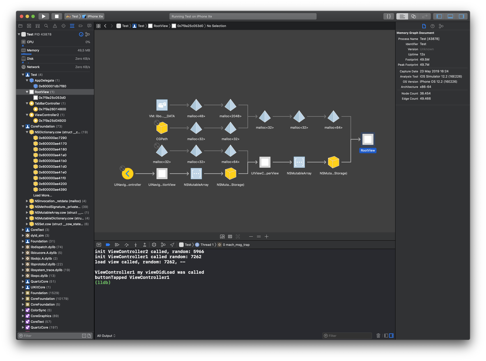
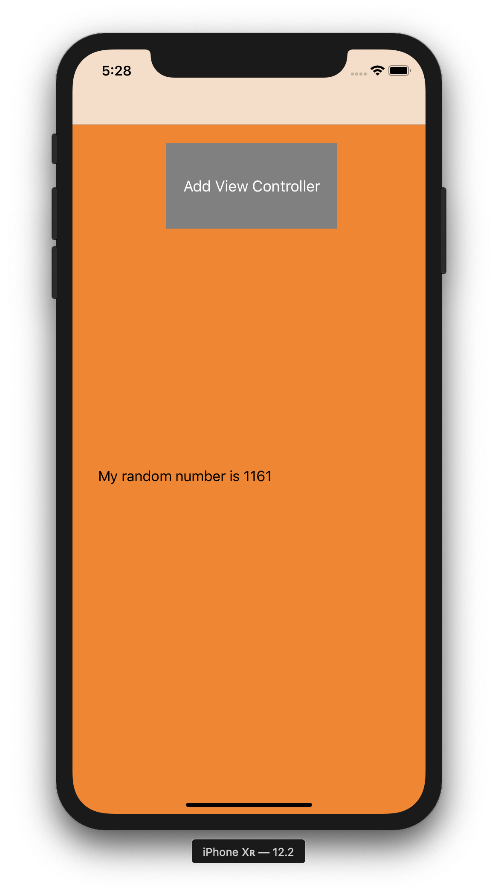
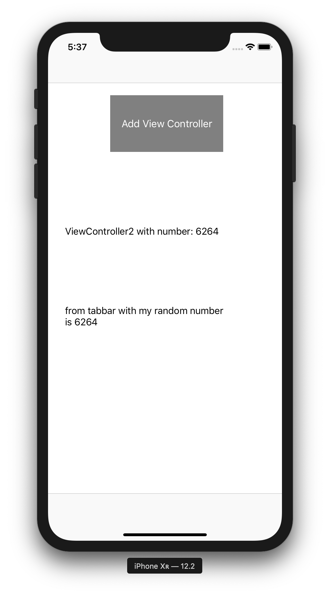
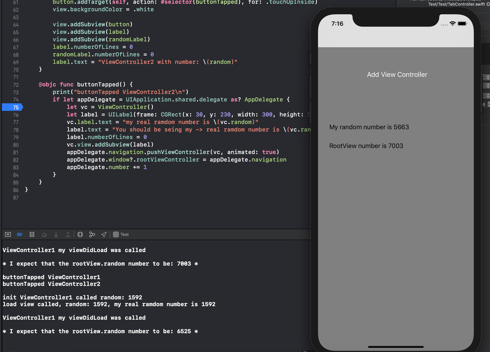

## Test

If you just run the app you should see a `ViewController` like:

Then you tap on the button, you should see another `ViewController` like:

Then you tap again on the button, you should be looking at a new instance of the `ViewController1`, 
nevertheless, you will see the first `RootView` of the previous `ViewController1` displayed on the screen. 

## Logs

Everytime the `init` block is called it will print `init ViewController1 called random: \(someRandom)`
Everytime the `loadView` block is called it will print `load view called, random: \(someRandom)`

So, I expect that for every displayed `UIViewController` on the screen the `init`  and the `loadView` to be called once!

Even though the `rootView` is created and assigned to the `ViewController1.view`, the `rootView` displayed is the previous one.